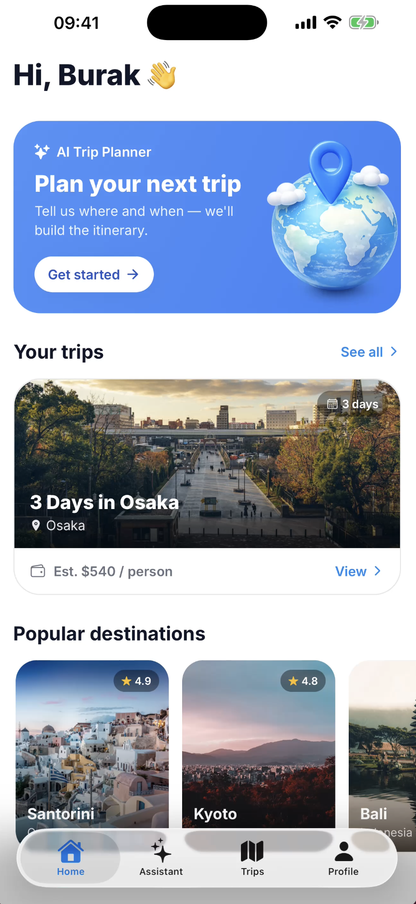
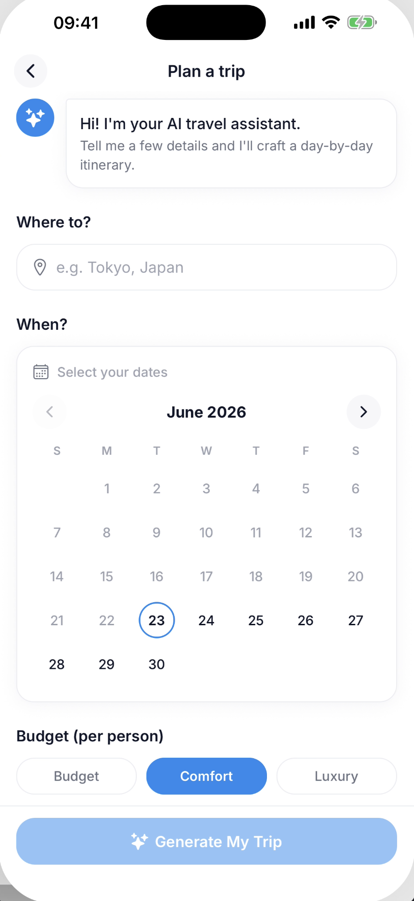
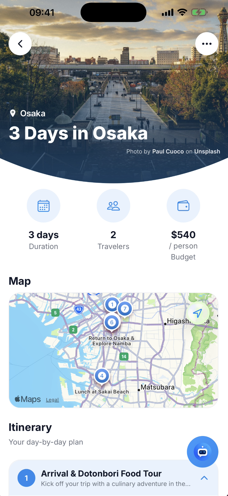
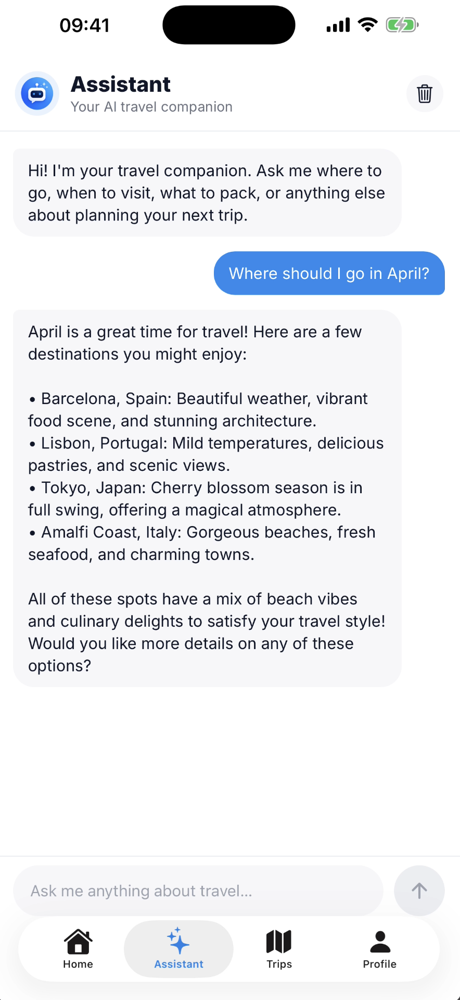
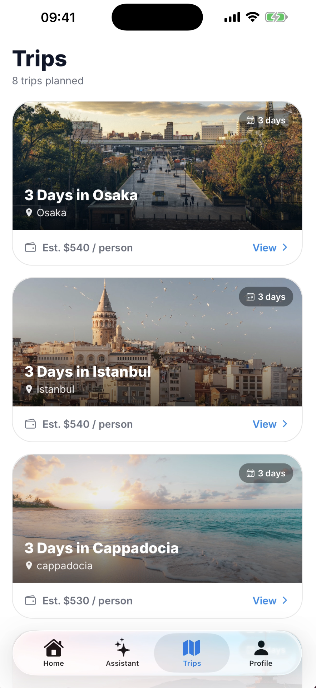
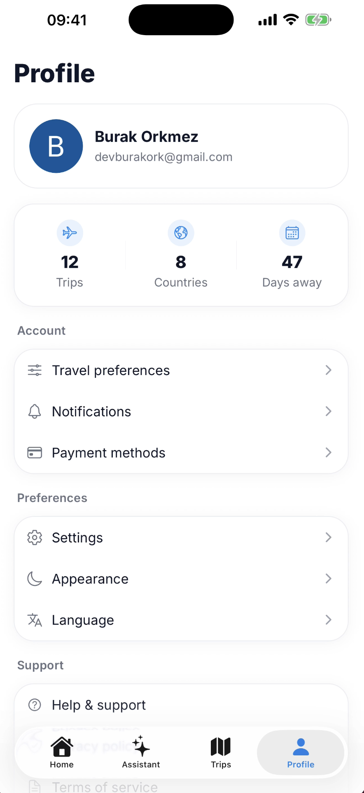
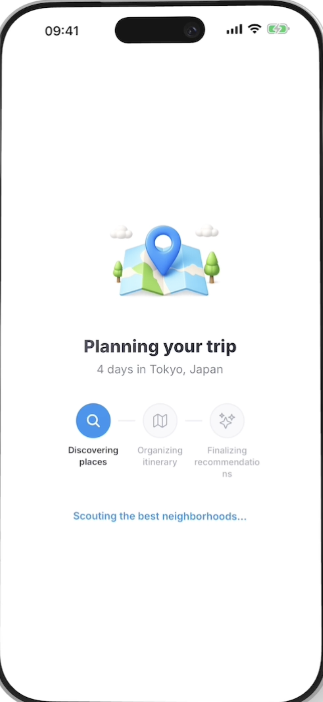
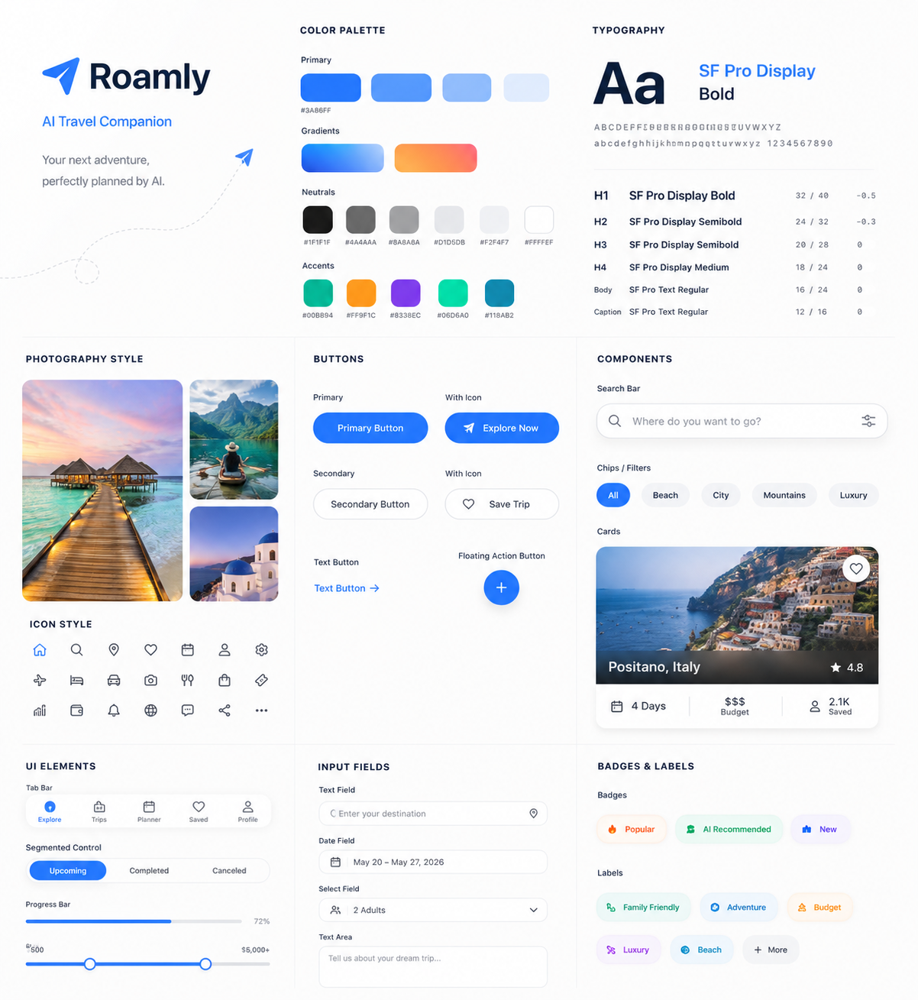

<h1 align="center">✈️ Triply — AI Trip Planner</h1>

<div align="center">

<h2>🛠️ Tech Stack</h2>

</div>

<div align="center">
  
  
  
  
  
  
  
  
  
  
  
  
  
</div>

---

<p align="center">
  <a href="https://github.com/GiorgiKavtaradze-prog/TriplyAi/stargazers">
    
  </a>
  <a href="https://github.com/GiorgiKavtaradze-prog/TriplyAi/blob/main/LICENSE">
    
  </a>
  <a href="https://github.com/GiorgiKavtaradze-prog/TriplyAi/issues">
    
  </a>
  <a href="https://github.com/GiorgiKavtaradze-prog/TriplyAi/pulls">
    
  </a>
</p>

<p align="center">
  
</p>

---

## 📋 Table of Contents

- [About](#-about)
- [Features](#-features)
- [Tech Stack](#-tech-stack)
- [Screenshots](#-screenshots)
- [Prerequisites](#-prerequisites)
- [Installation](#-installation)
- [Configuration](#-configuration)
- [Development](#-development)
- [Project Structure](#-project-structure)
- [API Documentation](#-api-documentation)
- [Testing](#-testing)
- [Deployment](#-deployment)
- [Contributing](#-contributing)
- [License](#-license)

---

## 🎯 About

**Triply** is a production-ready, cross-platform mobile application that leverages artificial intelligence to create personalized travel itineraries. Built with modern Expo SDK 56 and React Native 0.85, it provides users with a seamless experience for planning trips using natural language interactions with an AI assistant.

The application features secure authentication via Clerk, real-time AI trip generation with OpenAI, cloud database storage with Neon PostgreSQL, and comprehensive error monitoring with Sentry.

---

## ✨ Features

### Authentication & Security
- 🔐 **Clerk Authentication** — Production-ready auth with OAuth 2.0
- 🍎 **Apple Sign-In** — Native iOS authentication
- 🌐 **Google Sign-In** — Cross-platform OAuth
- 🗝️ **Secure Token Storage** — Expo Secure Store integration
- 🚪 **Secure Logout** — Complete session cleanup
- 🗑️ **Account Deletion** — Full database cleanup on request

### AI Trip Planning
- 🤖 **OpenAI Integration** — GPT-powered trip generation
- 💬 **AI Assistant** — Natural language trip modifications
- 🗺️ **Day-by-Day Itinerary** — Detailed travel plans
- 📍 **Location Mapping** — Interactive maps with trip locations
- 🏞️ **Destination Images** — Unsplash API integration
- ⚡ **Background Processing** — Inngest job queues

### User Experience
- 🎨 **NativeWind v4** — Utility-first styling
- 🪟 **iOS Liquid Glass** — Native tab effects
- 🏠 **Home Dashboard** — Latest trips & popular destinations
- 🧳 **Trips Management** — View all generated plans
- 👤 **Profile Management** — Account settings & preferences
- ⭐ **App Rating** — In-app review prompts

### Infrastructure
- ☁️ **Neon PostgreSQL** — Serverless database
- 🖼️ **ImageKit** — Image optimization & delivery
- 🐞 **Sentry** — Error tracking & monitoring
- 📄 **Legal Pages** — Privacy, Terms, Support

---

## 📱 Screenshots

| Home Screen | Trip Generation | Trip Details | AI Assistant |
|-------------|-----------------|--------------|--------------|
|  |  |  |  |

| Trips Screen | Profile Screen | Loading State | Design System |
|--------------|----------------|---------------|----------------|
|  |  |  |  |

---

## 📦 Prerequisites

- **Node.js** >= 20.x
- **npm** >= 10.x or **pnpm** >= 9.x
- **Expo CLI** >= 56.x
- **iOS Simulator** or **Android Studio** (for native builds)
- **Git** >= 2.40

---

## 🚀 Installation

```bash
# Clone the repository
git clone https://github.com/GiorgiKavtaradze-prog/TriplyAi.git
cd TriplyAi

# Install dependencies
npm install
# or
pnpm install
```

---

## ⚙️ Configuration

Create a `.env` file in the project root:

```bash
# Authentication (Clerk)
EXPO_PUBLIC_CLERK_PUBLISHABLE_KEY=<your_clerk_publishable_key>
CLERK_SECRET_KEY=<your_clerk_secret_key>
CLERK_WEBHOOK_SIGNING_SECRET=<your_clerk_webhook_signing_secret>

# Database (Neon PostgreSQL)
DATABASE_URL=<your_neon_postgres_database_url>

# AI Services
OPENAI_API_KEY=<your_openai_api_key>

# Image Services
UNSPLASH_ACCESS_KEY=<your_unsplash_access_key>
UNSPLASH_SECRET_KEY=<your_unsplash_secret_key>
IMAGEKIT_PRIVATE_KEY=<your_imagekit_private_key>
IMAGEKIT_PUBLIC_KEY=<your_imagekit_public_key>
IMAGEKIT_URL_ENDPOINT=<your_imagekit_url_endpoint>

# Monitoring
SENTRY_AUTH_TOKEN=<your_sentry_auth_token>

# Development
INNGEST_DEV=<your_inngest_dev_value>
```
```

---

## 💻 Development

```bash
# Start development server
npm run start

# Run on iOS simulator
npm run ios

# Run on Android emulator
npm run android

# Run web version
npm run web

# Lint code
npm run lint

# Database operations
npm run db:generate  # Generate migrations
npm run db:push      # Push schema to database
npm run db:studio    # Open Drizzle Studio

# Inngest dev server
npm run inngest
```

---

## 📁 Project Structure

```
src/
├── app/                    # Expo Router screens
│   ├── (auth)/            # Authentication routes
│   ├── (tabs)/            # Tab navigation screens
│   ├── api/               # API endpoints
│   └── _layout.tsx        # Root layout
├── components/            # Reusable UI components
├── db/                    # Database schema & client
│   ├── schema.ts
│   └── client.ts
├── hooks/                 # Custom React hooks
├── lib/                   # Utility functions
└── inngest/               # Background job functions
```

---

## 📚 API Documentation

### Authentication Endpoints
- `POST /api/auth/webhook` — Clerk webhook handler

### Trip Endpoints
- `POST /api/trips/generate` — Generate new trip
- `GET /api/trips/[id]` — Get trip details
- `PUT /api/trips/[id]` — Update trip
- `DELETE /api/trips/[id]` — Delete trip

### Inngest Functions
- `generateTrip` — Background trip generation job
- `processImage` — Image optimization job

---

## 🧪 Testing

```bash
# Run tests (when configured)
npm test

# Type checking
npx tsc --noEmit

# Lint with auto-fix
npm run lint -- --fix
```

---

## 📦 Deployment

### Mobile App
1. Build production binaries:
   ```bash
   eas build --platform ios
   eas build --platform android
   ```

2. Submit to app stores:
   ```bash
   eas submit --platform ios
   eas submit --platform android
   ```

### Web (Legal Pages)
Deploy the `legal/` directory to Cloudflare Pages or any static hosting provider.

---

## 🤝 Contributing

Contributions are welcome! Please follow these steps:

1. Fork the repository
2. Create a feature branch (`git checkout -b feature/amazing-feature`)
3. Commit changes (`git commit -m 'Add amazing feature'`)
4. Push to branch (`git push origin feature/amazing-feature`)
5. Open a Pull Request

Please ensure code follows the project's ESLint and Prettier configurations.

---

## 📄 License

This project is licensed under the MIT License — see the [LICENSE](LICENSE) file for details.

---

## 👤 Author

**Giorgi Kavtaradze**

- GitHub: [@GiorgiKavtaradze-prog](https://github.com/GiorgiKavtaradze-prog)
- Twitter: [@giorgikavtaradz](https://twitter.com/giorgikavtaradz)

---

<p align="center">
  
</p>